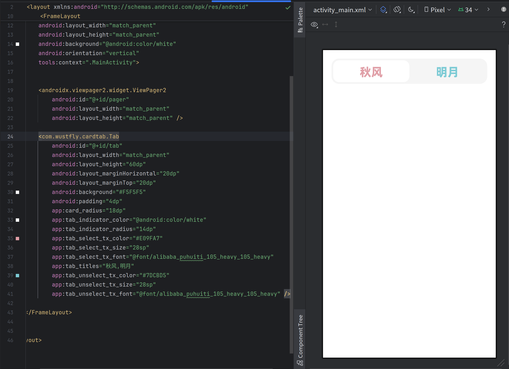

# CardTab
一款好用的android Tab控件，能在布局文件中被渲染，在开发中能够即时查看效果，所见即所得

## 用法

代码

```
<com.wustfly.cardtab.Tab
    android:id="@+id/tab"
    android:layout_width="match_parent"
    android:layout_height="60dp"
    android:layout_marginHorizontal="20dp"
    android:layout_marginTop="20dp"
    android:background="#F5F5F5"
    android:padding="4dp"
    app:card_radius="18dp"
    app:tab_indicator_color="@android:color/white"
    app:tab_indicator_radius="14dp"
    app:tab_select_tx_color="#E09FA7"
    app:tab_select_tx_size="28sp"
    app:tab_select_tx_font="@font/alibaba_puhuiti_105_heavy_105_heavy"
    app:tab_titles="秋风,明月"
    app:tab_unselect_tx_color="#7DCBD5"
    app:tab_unselect_tx_size="28sp"
    app:tab_unselect_tx_font="@font/alibaba_puhuiti_105_heavy_105_heavy" />
```

```
inner class Pager {

    private val adapter = object : FragmentStateAdapter(m) {
        override fun getItemCount(): Int {
            return 2
        }

        override fun createFragment(position: Int): Fragment {
            return if (position == 0) LeftFragment() else RightFragment()
        }

    }

    init {
        binding.pager.adapter = adapter
        binding.tab.bindPager(binding.pager)
    }
}
```
效果：



{ width=200px }